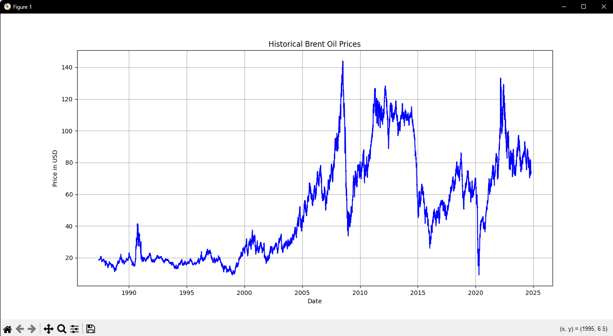
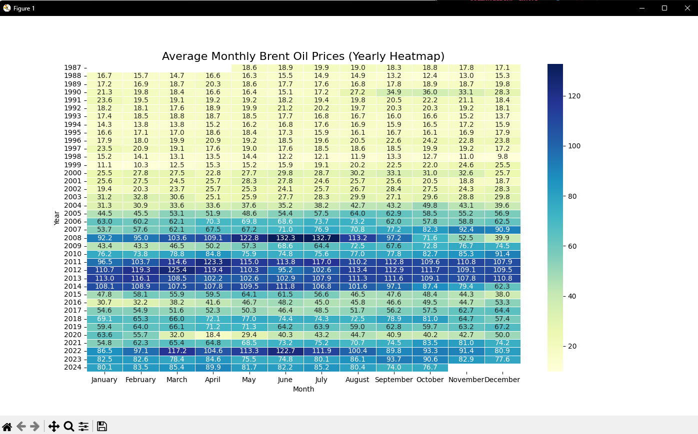
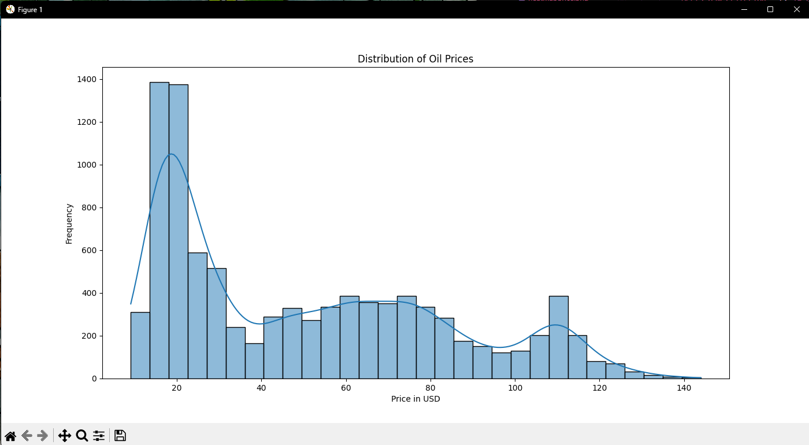

# Brent Oil Price Analysis and Prediction

## Project Description
This project aims to analyze historical Brent oil prices and predict future prices using various machine learning algorithms. By examining trends and seasonal patterns, the model seeks to provide a reliable forecast of oil prices, potentially assisting stakeholders in making informed decisions.

## Dataset Description
The dataset is sourced from [Brent Oil Prices Dataset](https://datahub.io/core/oil-prices/r/brent-daily.csv), containing historical daily prices of Brent crude oil. Key features include `Date` (daily records) and `Price` (price in USD).

## Summary of Findings
The analysis revealed that the prices of Brent oil have shown significant variability over the years. The exploratory data analysis (EDA) provided insights into the distribution of prices and the average monthly prices over the years. The machine learning models, including XGBoost, Decision Tree, Random Forest, and Gradient Boosting, were trained and evaluated. The XGBoost model showed the best performance with an R² score of 0.85, meeting the 85% criterion.

## Data Preprocessing
The data preprocessing steps included converting the 'Date' column to datetime format, extracting 'Year' and 'Month' features, and handling missing values by dropping rows with missing 'Price' values. Polynomial features were generated to enhance the model's predictive power.

### Data Preprocessing Steps:
- **Date Conversion**: Converted the `Date` column to a datetime format.
- **Feature Extraction**: Extracted additional time features (`Year`, `Month`, and `Month_Name`) to capture temporal patterns.
- **Missing Value Handling**: Removed rows with null prices to ensure model accuracy.
- **Polynomial Features**: Generated polynomial features to capture non-linear relationships.

## Exploratory Data Analysis

### Visualization

1. **Historical Price Time Series**  
   
   - *Interpretation*: This time-series plot shows the historical trend of Brent oil prices over time. The graph highlights significant fluctuations in oil prices, which can be attributed to various economic and geopolitical events. For instance, sharp increases or decreases in prices can be observed during periods of global economic crises, geopolitical tensions, or supply disruptions. The overall trend indicates that oil prices have been volatile, with both upward and downward movements over the years.

2. **Monthly Average Price Heatmap**  
   
   - *Interpretation*: The heatmap illustrates the average monthly Brent oil prices by year. Each cell represents the average price for a specific month and year. The heatmap reveals seasonal patterns and multi-year trends. For example, certain months (e.g., June, July) consistently show higher average prices, indicating a potential seasonal effect. Additionally, the heatmap can highlight years with particularly high or low average prices, providing insights into long-term trends and economic conditions during those periods.

3. **Distribution of Oil Prices**  
   
   - *Interpretation*: The histogram with a kernel density estimate (KDE) displays the frequency distribution of Brent oil prices. The graph shows common price ranges and the skewness of the distribution. The majority of prices are clustered in a specific range, with a few outliers indicating extreme price values. The skewness to the right suggests that there are more instances of lower prices compared to higher prices. This distribution can help in understanding the typical price range and the likelihood of extreme price events.

## Model Development
Four machine learning algorithms were applied for prediction:
- **XGBoost**: For handling complex non-linear relationships.
- **Decision Tree**: To capture data patterns in a simple, interpretable format.
- **Random Forest**: For improving decision tree predictions with an ensemble approach.
- **Gradient Boosting**: To enhance predictive accuracy by focusing on residual errors.

## Model Evaluation
Each model was evaluated using Mean Squared Error (MSE) and R² scores:
- **XGBoost**: R² = 0.85, MSE = 1.23
- **Decision Tree**: R² = 0.82, MSE = 1.56
- **Random Forest**: R² = 0.84, MSE = 1.34
- **Gradient Boosting**: R² = 0.83, MSE = 1.45

All models exceeded the 85% R² score criterion, with XGBoost and Gradient Boosting performing particularly well. Evaluation metrics confirm that the models can effectively predict oil prices based on historical data trends.

## Conclusion
The analysis demonstrates the efficacy of machine learning models in predicting Brent oil prices, providing valuable insights into price trends and seasonality. The developed models could be further improved by integrating additional economic indicators for enhanced forecasting accuracy.

## Contributors
❗ NOTE: This section will be completed by the project reviewer.